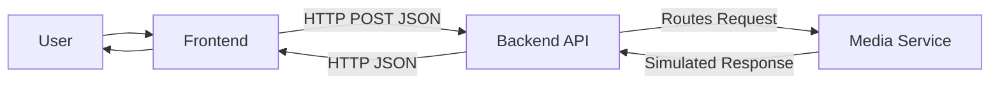

# System Architecture

This document describes the high-level architecture of the Dany Template.

## System Flow

The application follows a clean, decoupled architecture:

## Flow Description

1. **User**: Interacts with the clean GUI to input a URL.
2. **Frontend**: A vanilla JavaScript application that handles UI interactions, validates input (basic), and constructs a `fetch` request to the backend.
3. **Backend API**: Engineered using Flask. Endpoints are registered via blueprints or route modules (e.g., `download_route.py`) to keep the routing layer purely focused on HTTP mechanics and request validation.
4. **Media Service**: The core decoupled service layer (`media_service.py`). In a real application, this is where external integrations, downloading functionality, or format conversion would happen. In this template, it contains secure, educational mocks explaining where logic should go.
5. **Response**: Using utility modules (`utils/response.py`), the backend formats consistent, predictable JSON responses for the frontend to consume and display.

## Design Goals

- **Separation of Concerns**: HTTP routing is strictly separated from business logic.
- **Maintainability**: New routes and service processors can be added without modifying the core entrypoint.
- **Educational Value**: Clear pointers are left throughout the codebase demonstrating where complex asynchronous, I/O-bound, or database logic would reside in a production system.
